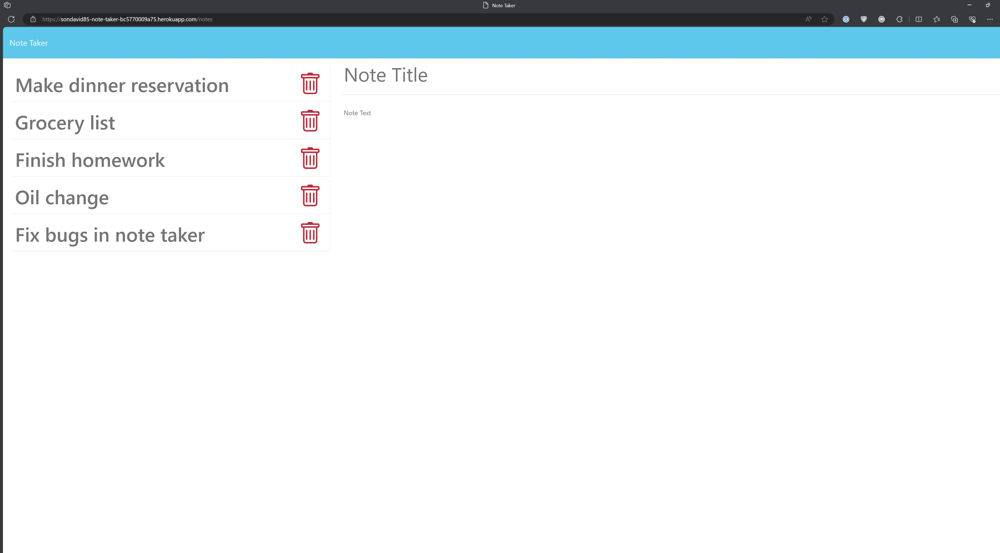

# Note Taker 
  
  ## Description
  Basic note taking app with non-local persistence
  ## Deployed Application URL
  https://sondavid85-note-taker-bc5770009a75.herokuapp.com/
  ## Screenshot
  
  ## Table of Contents
  * [Features](#features)
  * [Languages & Dependencies](#languages)
  * [Usage](#Usage)
  * [Contributors](#contributors)
  * [Testing](#testing)
  * [Questions](#questions)
  ## Features
  n/a
  ## Languages
  Node.js, express, ejs, body-parser, figlet
  ## Usage
  javascript, html, css
  ## Contributors
  n/a
  ## Testing
  From the main page, click Get Started to retrieve any notes. Make sure you can add, delete, and edit notes.
  ## Questions
  Please send your questions [here](mailto:sondavid85@yahoo.com?subject=[GitHub]%20Dev%20Connect) or visit [github/sondavid85](https://github.com/sondavid85).
  